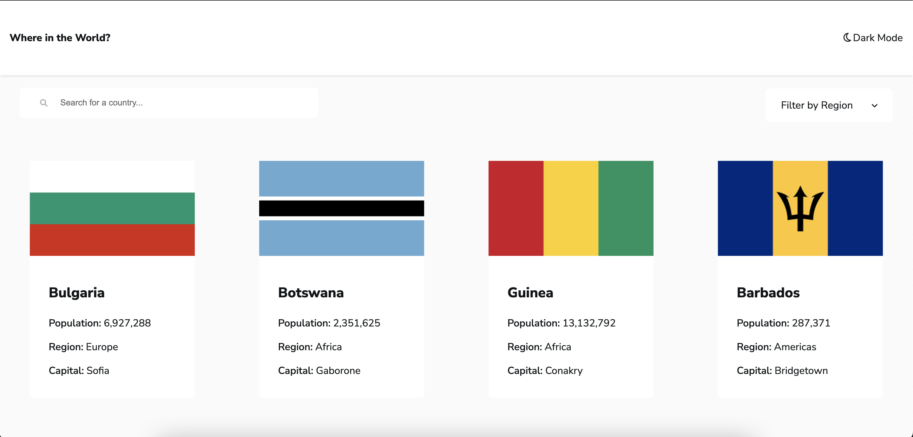

# REST Countries API Project

This is a solution to the [REST Countries API with color theme switcher challenge on Frontend Mentor](https://www.frontendmentor.io/challenges/rest-countries-api-with-color-theme-switcher-5cacc469fec04111f7b848ca).

## Table of contents

- [Overview](#overview)
  - [The challenge](#the-challenge)
  - [Screenshot](#screenshot)
  - [Links](#links)
- [My process](#my-process)
  - [Built with](#built-with)
  - [What I learned](#what-i-learned)
- [Author](#author)

## Overview

### The challenge

Users should be able to:

- See all countries from the API on the homepage
- Search for a country using an `input` field
- Filter countries by region
- Click on a country to see more detailed information on a separate page
- Click through to the border countries on the detail page
- Toggle the color scheme between light and dark mode _(optional)_

### Screenshot

### Links

- Live Site URL: [Countries-API](https://countries-api-six-alpha.vercel.app/)

## My process

### Built with

- Semantic HTML5 markup
- HTML
- CSS/SCSS
- [Create Next App](https://nextjs.org/docs/api-reference/create-next-app)
- [React](https://reactjs.org/) - JS library
- [Next.js](https://nextjs.org/) - React framework
- [css-modules](https://github.com/css-modules/css-modules) - Came pre-installed with Create Next App

### What I learned

Through working on this project, I was able to learn the basics of Next.js, the server-side framework for React. In addition to this, I also got some experience working with React's Context API. Context was used to persist the theme throughout the pages.

## Author

- LinkedIn - [Link](https://www.linkedin.com/in/jasonc-francois/)
- Frontend Mentor - [@Jason-Francois](https://www.frontendmentor.io/profile/Jason-Francois)
